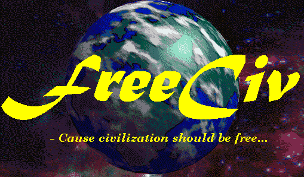

# HELLO WORLD!
## Some errors here and there, but nothing to claim!

<table>
  <tr>
    <td>
      
    </td>
    <td>
      
    </td>
  </tr>
</table>
Look at me!! I'm the left guy!

***

## What is the meaning of life? What is my purpose? Why am I ugly? WHERE CAN I FIND ANSWERS TO MY QUESTIONS?
Linux is the truth. Apple is basically selling Linux to people those think they are safe after pay at least thousand dollars(not miles!) for the cheapest product they offer. Yeah man, I would think too whether I pay the same value. I won't say anything about Windows because I don't want to do fight with 99% of developers...

## Cool projects

  <a href="https://github.com/CastCris/tiny_games"/>Little Games!</a>

  <a href="https://github.com/CastCris/labor_c"/>A git dir with useless c functions</a>

  <a href="https://github.com/Place-code/BeerCrowd/tree/Cristiano">Repository with resolutions for programing contest</a>

## Call me to play Freeciv!

send a email to: cristianochincarosanches@gmail.com

<table>
  <tr>
    <td>
      
    </td>
    <td>
      
    </td>
  </tr>
</table>
