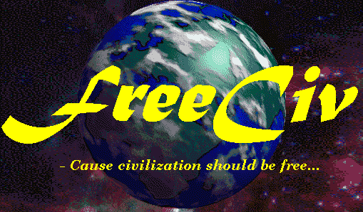
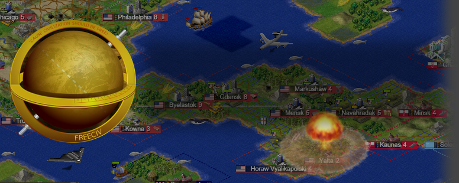

# > HELLO WOLRD!
```c
#include<stdio.h>

/* */
int main()
{
  printf("HELLO WORLD!\n");
  return 0;
}
```
```bash
cc -o main main.c
./main
```

## Some errors here and there, but nothing to claim!

<table>
  <tr>
    <td>
      
    </td>
    <td>
      
    </td>
  </tr>
</table>
Look at me!! I'm the left guy!

***

## What is the meaning of life? What is my purpose? Why am I ugly? WHERE CAN I FIND ANSWERS TO MY QUESTIONS?
Lorem ipsum dolor sit amet, consectetur adipiscing elit. Nullam ac cursus lorem. In tempus ultricies mollis. Etiam ac orci consequat, hendrerit velit semper, feugiat lacus. Suspendisse velit arcu, malesuada ac ligula scelerisque, dictum aliquet purus. Class aptent taciti sociosqu ad litora torquent per conubia nostra, per inceptos himenaeos. Aenean pharetra arcu a odio maximus varius. Donec ex sapien, maximus et euismod id, scelerisque vitae felis.

## Lovely Code(s)
<div align="center">
  <a href="https://github.com/CastCris/ScriptOlympicGames">
    Script Olympic Games!
  </a>
  <br>
  <a href="https://github.com/CastCris/TinkerCode">
    TinkerCode
  </a>
</div>

## My gists!
<div align="center">
  <a href="https://gist.github.com/CastCris">
    Gists
  </a>
</div>

## Call me to play Freeciv!
<p>send a email to: cristianochincarosanches@gmail.com</p>
<table>
  <tr>
    <td>
      
    </td>
    <td>
      
    </td>
  </tr>
</table>
